# solar_station_1.csv 数据集分析报告

## 1. 基本信息

| 项目 | 值 |
|---|---|
| 总行数 | 70,176 |
| 时间范围 | 2019-01-01 00:00:00 ~ 2020-12-31 23:45:00 |
| 时间粒度 | 15分钟 |
| 每天数据点 | 96 (无缺失天) |
| 总天数 | 731 |
| 标称容量 | 50 MW |
| 电站ID (sid) | 1 |

### 列说明

| 列名 | 类型 | 说明 |
|---|---|---|
| sid | int | 电站编号 |
| time | datetime | 时间戳 (15分钟间隔) |
| tsi | float | 总太阳辐射 (W/m²) |
| dni | float | 直射法线辐射 (W/m²) |
| ghi | float | 全局水平辐射 (W/m²) |
| temp | float | 温度 (°C) |
| atm | float | 大气压 (hPa) |
| rh | float | 相对湿度 (%) |
| power | float | 发电功率 (MW) |
| cap | float | 标称容量 (MW) |

## 2. 数据质量

### 缺失标记 (-99)

| 列 | -99数量 | 占比 |
|---|---|---|
| tsi | 60 | 0.09% |
| dni | 60 | 0.09% |
| ghi | 60 | 0.09% |
| temp | 60 | 0.09% |
| atm | 60 | 0.09% |
| rh | 60 | 0.09% |

### 湿度 (rh) 异常值

- rh > 100% 的数据: **6747 条** (9.6%)
- 异常值范围: 最大达 6553.5% (明显是传感器故障)
- 正常范围 (0-100%) 内: 63369 条, 均值=23.2%, std=18.2%
- **影响**: 若不处理, Min-Max 归一化时 max=6553.5, 正常值全被压缩到 0~0.015 范围, 该特征等于废掉

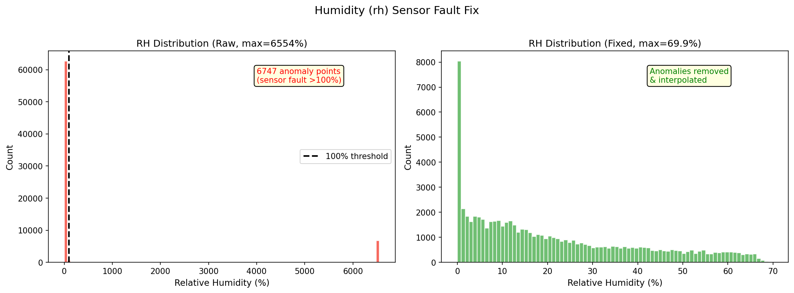

> 左图: 原始 rh 分布, 6747 个传感器故障点 (>100%) 集中在 6553% 附近;
> 右图: 修复后分布, 范围恢复到 0~69.9%

## 3. 功率 (power) 分布

| 统计量 | 值 (MW) |
|---|---|
| count | 70176.00 |
| mean | 9.67 |
| std | 13.71 |
| min | 0.00 |
| 25% | 0.00 |
| 50% | 0.00 |
| 75% | 18.79 |
| max | 48.32 |

- 零值 (夜间): **35264 条 (50.3%)**
- 正值 (白天): 34912 条 (49.7%)
- 归一化 (power/cap): mean=0.1934, max=0.9664

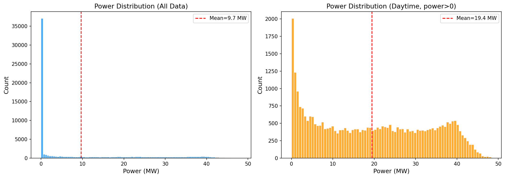

> 左图: 全量数据, 50% 零值主导; 右图: 仅白天 (power>0), 呈双峰分布, 均值 19.4 MW

### 功率分布区间

| 区间 (MW) | 数量 | 占比 |
|---|---|---|
| [0, 0.01) | 35,385 | 50.4% |
| [0.01, 5) | 7,459 | 10.6% |
| [5, 10) | 3,907 | 5.6% |
| [10, 20) | 6,728 | 9.6% |
| [20, 30) | 6,914 | 9.9% |
| [30, 40) | 7,392 | 10.5% |
| [40, 50) | 2,391 | 3.4% |

### 白天 (power > 0) 功率统计

- 样本数: 34912
- 均值: 19.44 MW
- 标准差: 13.70 MW
- 变异系数 (CV): 0.705

## 4. 气象特征统计

| 特征 | min | max | mean | std | 夜间均值 | 白天均值 | 近零占比 |
|---|---|---|---|---|---|---|---|
| tsi | 0.0 | 1359.0 | 266.36 | 367.99 | 2.08 | 533.30 | 51.3% |
| dni | 0.0 | 980.0 | 93.33 | 200.83 | 2.17 | 185.40 | 66.8% |
| ghi | 0.0 | 989.0 | 67.70 | 111.21 | 0.30 | 135.77 | 51.3% |
| temp | -18.2 | 41.2 | 13.14 | 14.34 | 8.99 | 17.33 | 0.0% |
| atm | 894.0 | 936.3 | 913.37 | 8.74 | 914.70 | 912.04 | 0.0% |
| rh | 0.0 | 69.9 | 23.22 | 18.22 | 26.85 | 19.08 | 2.4% |

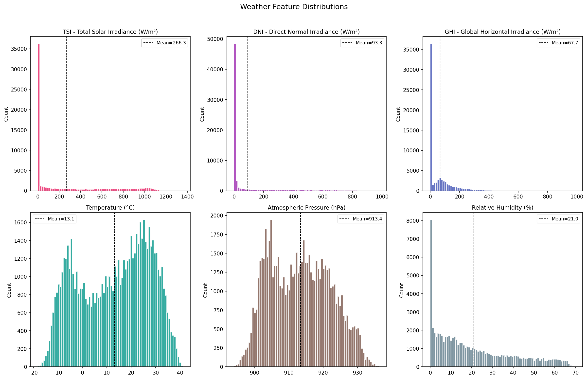

> 6 个气象特征的分布直方图。辐射类 (tsi, dni, ghi) 因夜间零值呈极度右偏;
> 温度呈双峰分布 (冬夏); 气压近似正态; 湿度以低值为主

## 5. 特征与功率相关性

| 特征 | 与power相关系数 | 强度 |
|---|---|---|
| tsi | 0.9465 | 强 |
| dni | 0.5789 | 中 |
| ghi | 0.6489 | 中 |
| temp | 0.2288 | 弱 |
| atm | -0.0577 | 弱 |
| rh | -0.2258 | 弱 |

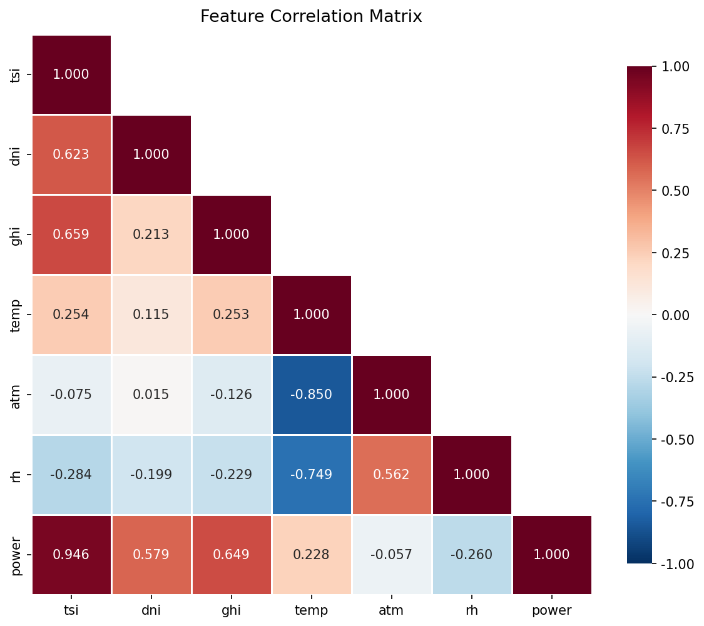

> tsi 与 power 相关系数 r=0.946, 是最强预测因子;
> temp 与 atm 强负相关 (r=-0.850), 存在多重共线性

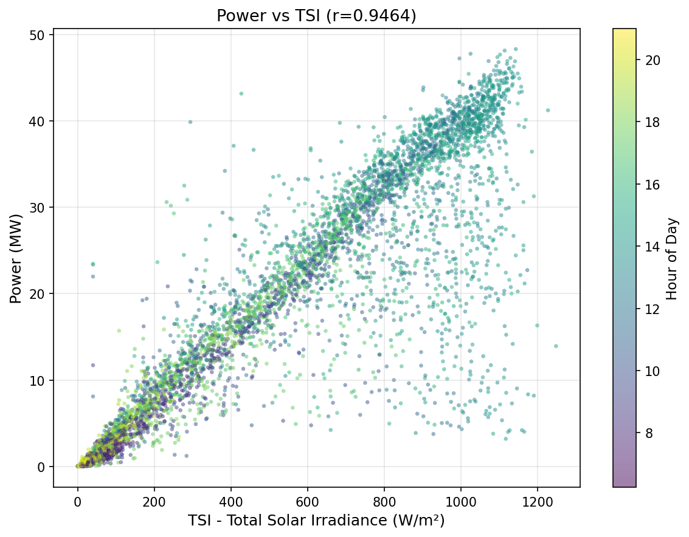

> 功率与 TSI 几乎呈线性关系, 颜色表示时间 (小时), 可见午间高辐射高功率

## 6. 功率自相关性

| 时间滞后 | 自相关系数 |
|---|---|
| 15min (lag=1) | 0.9867 |
| 1h (lag=4) | 0.9108 |
| 2h (lag=8) | 0.7407 |
| 4h (lag=16) | 0.2928 |
| 24h (lag=96) | 0.8741 |

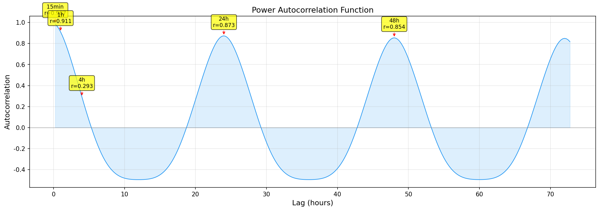

> 明显的 24h 周期性 (日出日落循环); 4h 滞后自相关仅 0.293, 说明 4 小时预测难度大;
> 24h 滞后 r=0.873, 昨日同时刻功率是有力参考

## 7. 日发电量分布

| 统计量 | 值 (MWh) |
|---|---|
| count | 731.00 |
| mean | 232.07 |
| std | 71.39 |
| min | 0.00 |
| 25% | 186.01 |
| 50% | 242.83 |
| 75% | 293.14 |
| max | 358.81 |

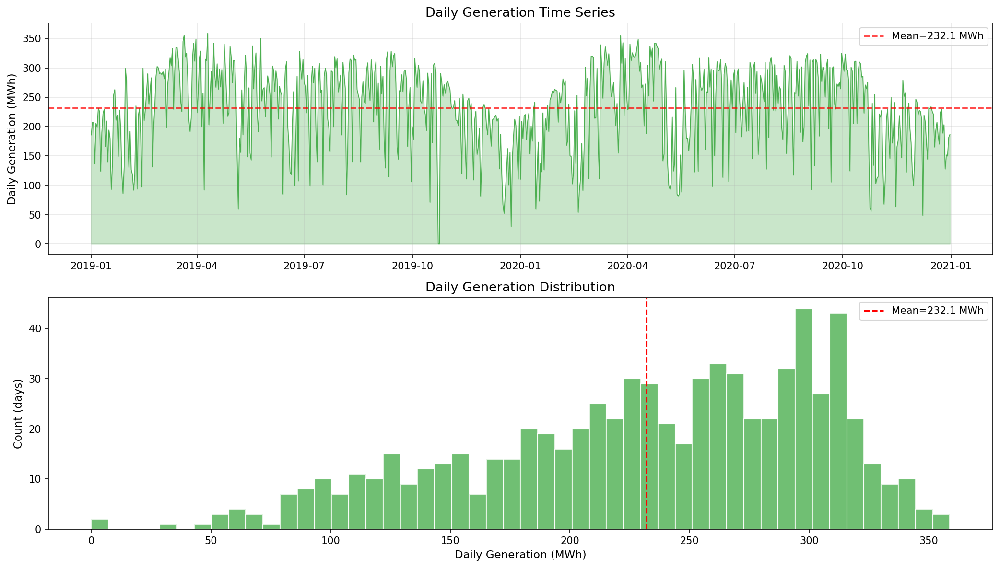

> 上图: 日发电量时间序列, 夏季发电量略高于冬季, 有明显的天气波动;
> 下图: 日发电量分布, 左偏 (多数天发电量偏高), 极少数天接近零 (连续阴天)

## 8. 按小时平均功率

| 时间 | 平均功率(MW) | 占峰值比 |
|---|---|---|
| 00:00 | 0.0 |  0% |
| 01:00 | 0.0 |  0% |
| 02:00 | 0.0 |  0% |
| 03:00 | 0.0 |  0% |
| 04:00 | 0.0 |  0% |
| 05:00 | 0.0 |  0% |
| 06:00 | 0.0 |  0% |
| 07:00 | 0.6 |  2% |
| 08:00 | 3.6 | ██ 11% |
| 09:00 | 10.8 | ██████ 34% |
| 10:00 | 20.3 | ████████████ 64% |
| 11:00 | 27.3 | █████████████████ 86% |
| 12:00 | 30.9 | ███████████████████ 97% |
| 13:00 | 31.9 | ████████████████████ 100% |
| 14:00 | 31.1 | ███████████████████ 98% |
| 15:00 | 28.4 | █████████████████ 89% |
| 16:00 | 23.3 | ██████████████ 73% |
| 17:00 | 15.1 | █████████ 47% |
| 18:00 | 6.8 | ████ 21% |
| 19:00 | 1.7 | █ 5% |
| 20:00 | 0.2 |  1% |
| 21:00 | 0.0 |  0% |
| 22:00 | 0.0 |  0% |
| 23:00 | 0.0 |  0% |

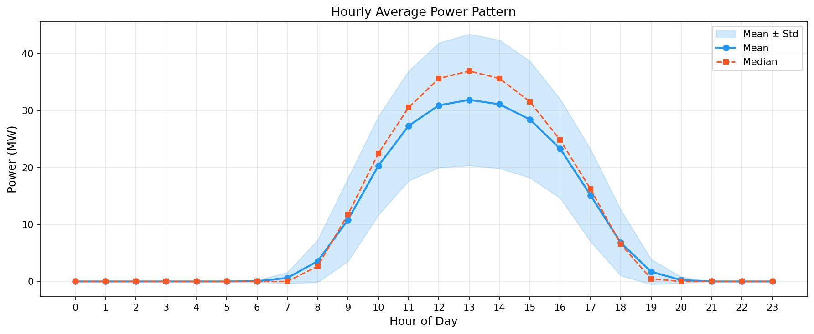

> 典型钟形发电曲线, 峰值在 13:00 (31.9 MW); 标准差带显示午间波动最大 (受云层影响);
> 中位数 > 均值说明晴天居多, 阴天拉低了均值

## 9. 按月平均功率

| 月份 | 平均功率(MW) |
|---|---|
| 1月 | 8.0 |
| 2月 | 8.4 |
| 3月 | 11.7 |
| 4月 | 11.9 |
| 5月 | 8.7 |
| 6月 | 10.2 |
| 7月 | 10.4 |
| 8月 | 10.7 |
| 9月 | 10.7 |
| 10月 | 9.8 |
| 11月 | 8.1 |
| 12月 | 7.5 |

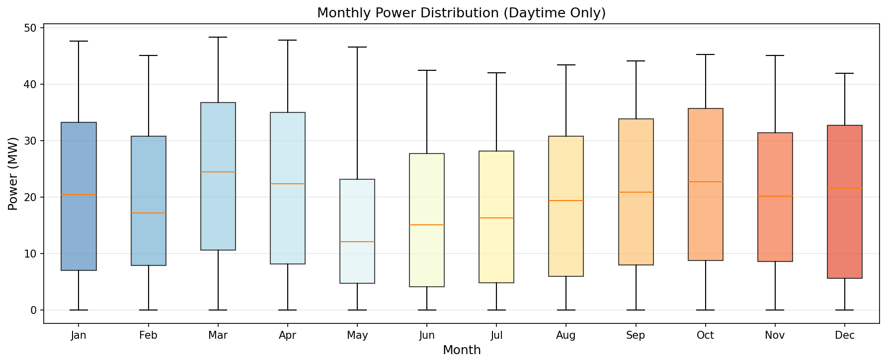

> 白天功率的月度箱线图; 3-4月、7-9月中位数较高; 12-1月最低;
> 各月箱体宽度相近, 季节影响小于天气波动

## 10. 功率波动性

- 相邻15分钟变化率 std: 2.234 MW
- 最大上升: +22.17 MW
- 最大下降: -35.39 MW
- 变化 > 20MW 的次数: 15 次

## 11. 夜间零值分析

- 连续零值段数: 732
- 平均长度: 48.1 步 = 12.0 小时
- 最长: 246 步 = 61.5 小时
- 最短: 1 步 = 0.2 小时

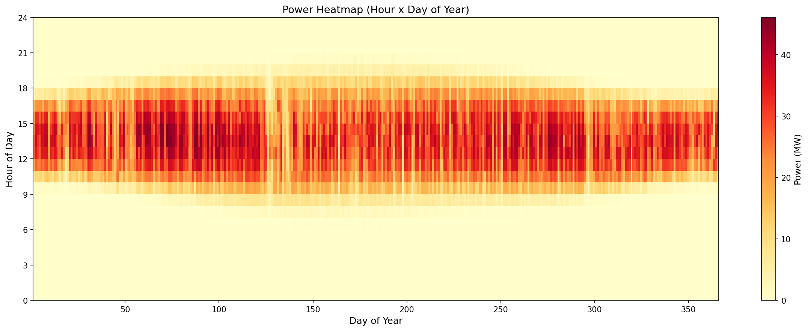

> 横轴为一年中的天 (Day of Year), 纵轴为小时;
> 清晰可见日照时长随季节变化 (夏季 6:00-20:00, 冬季 8:00-18:00);
> 颜色深浅反映功率大小, 中午时段最强

## 12. 滑动窗口训练样本分析 (96步输入→16步预测)

| 目标类型 | 数量 | 占比 |
|---|---|---|
| 全零 (纯夜间) | 24,712 | 35.3% |
| 部分零 (日夜交界) | 21,849 | 31.2% |
| 全非零 (纯白天) | 23,504 | 33.5% |

## 13. 预测难度分析

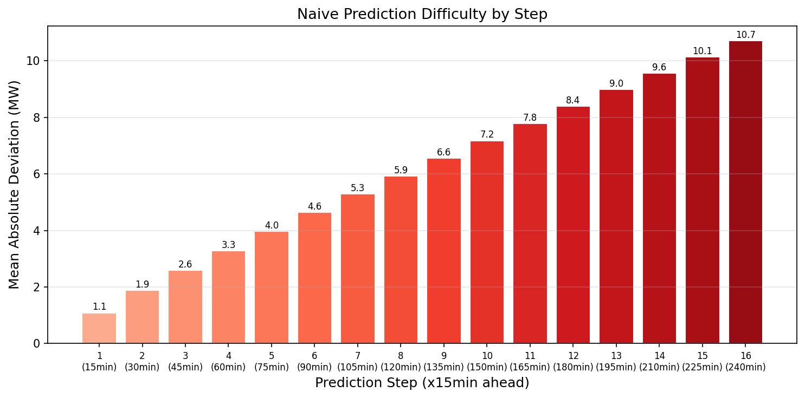

> Naive 基线 (重复当前值) 在不同预测步上的平均绝对偏差:
> Step 1 (15min): 1.1 MW → Step 16 (4h): 10.7 MW
> 预测越远误差越大, 4 小时预测天然困难

## 14. 数据处理建议

1. **rh 异常值必须处理**: 6,747 条 >100% 的传感器故障值会毁掉归一化, 建议替换为 NaN 后插值
2. **训练时过滤纯夜间样本**: 35% 的全零目标是白送分, 会稀释模型对白天预测的学习效果
3. **考虑残差预测**: 白天 Naive 基线 (重复最后一步) MAE=10.96MW, 让模型预测偏差量比绝对值更容易
4. **增加衍生特征**: 如前1h功率变化率、前24h同时刻功率, 帮助模型捕捉趋势
5. **tsi 是最强预测因子** (r=0.9465), 确保 tsi 在特征中被充分利用

---

*图表生成脚本: `generate_plots.py` | 图片目录: `plots/`*
